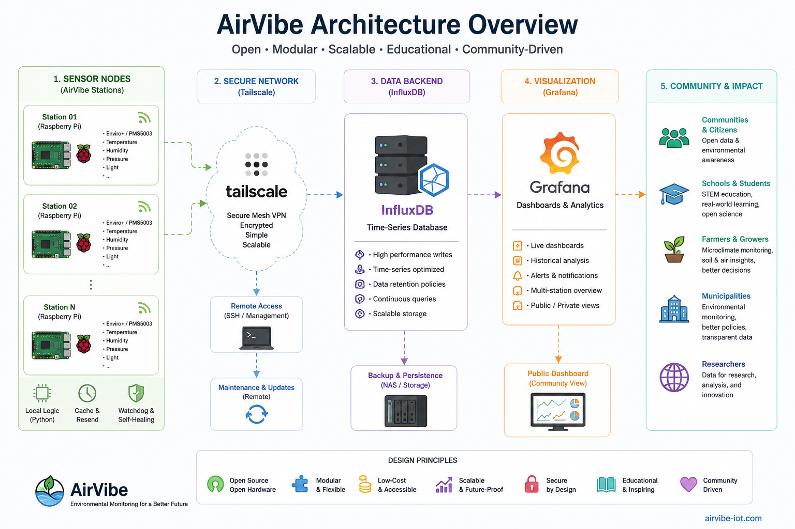

# AirVibe IoT

Open environmental infrastructure built with Raspberry Pi.

AirVibe combines environmental monitoring, open-source infrastructure, education, citizen science and community-driven sensing into a modular ecosystem for schools, municipalities, researchers and agriculture.

---

## Vision

AirVibe is designed as an open environmental platform that connects:

- schools and STEM education
- citizen science initiatives
- municipalities and local communities
- researchers and environmental monitoring
- agriculture and microclimate observation
- Raspberry Pi and open-source ecosystems

The goal is to make environmental sensing more accessible, understandable and reproducible.

---

## Features

- Raspberry Pi based sensor stations
- Distributed environmental monitoring
- Real-time data collection
- InfluxDB time-series backend
- Grafana dashboards
- Remote connectivity with Tailscale
- Low-cost deployments
- Modular architecture
- Educational and community-oriented design

---

## Current Deployments

Current AirVibe stations include indoor and outdoor deployments across multiple locations.

Examples:
- Radovljica
- OMS Ljubljana
- Lancovo
- Kamna Gorica
- Postojna
- Polhov Gradec
- EIMV laboratory

---

## Architecture



```text
Sensors → Raspberry Pi → InfluxDB → Grafana → Web Dashboard
```

More detailed architecture documentation will be added in `/docs`.

---

## Documentation

Project documentation is being organized into the `/docs` directory.

Planned sections:
- station documentation
- deployment guides
- architecture diagrams
- Grafana setup
- InfluxDB setup
- Tailscale connectivity
- educational deployment guides

---

## Community Direction

AirVibe is evolving into:
- an educational platform
- a citizen science network
- a municipal pilot framework
- an agricultural monitoring ecosystem
- an open environmental infrastructure project

---

## Roadmap

- [x] Distributed Raspberry Pi sensor nodes
- [x] Centralized InfluxDB backend
- [x] Grafana dashboards
- [x] Remote management with Tailscale
- [ ] Public live map
- [ ] Simplified node deployment
- [ ] Educational kits for schools
- [ ] Open API
- [ ] Community dashboards
- [ ] Agricultural monitoring modules

---

## Repository Structure

```text
airvibe-iot/
│
├── README.md
├── docs/
├── diagrams/
├── scripts/
├── images/
└── examples/
```

---

## Philosophy

AirVibe is not only an air quality project.

It is an attempt to build open, understandable and community-driven environmental infrastructure using accessible hardware and open-source tools.

---

## License

License information will be added soon.