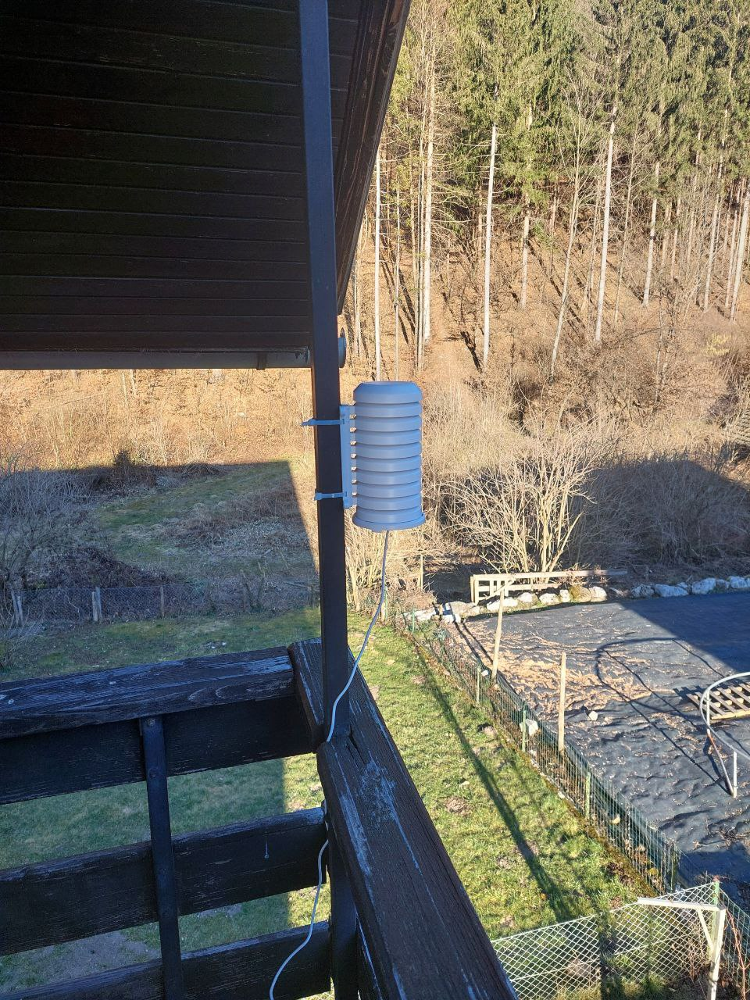
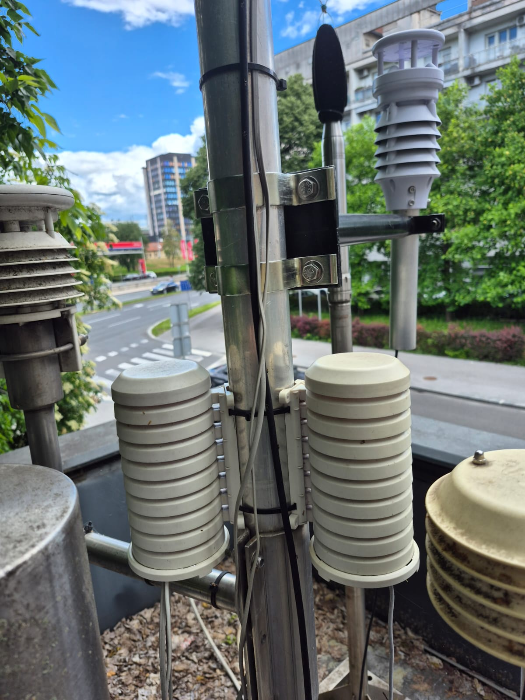
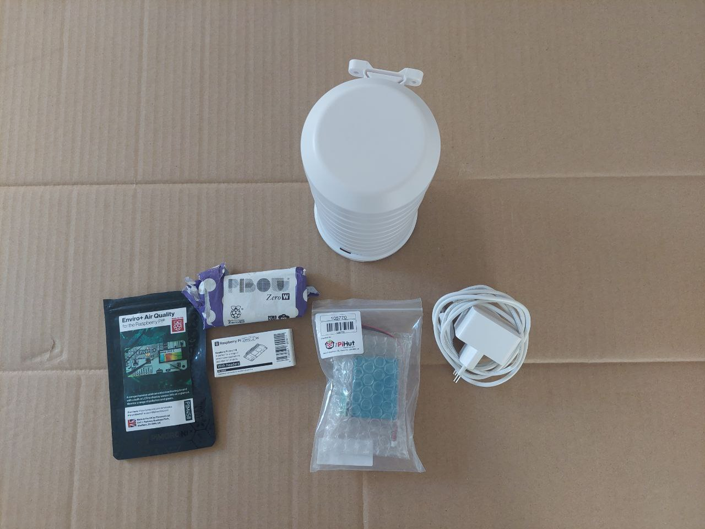
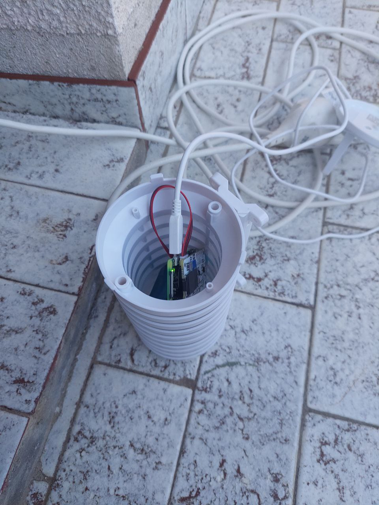
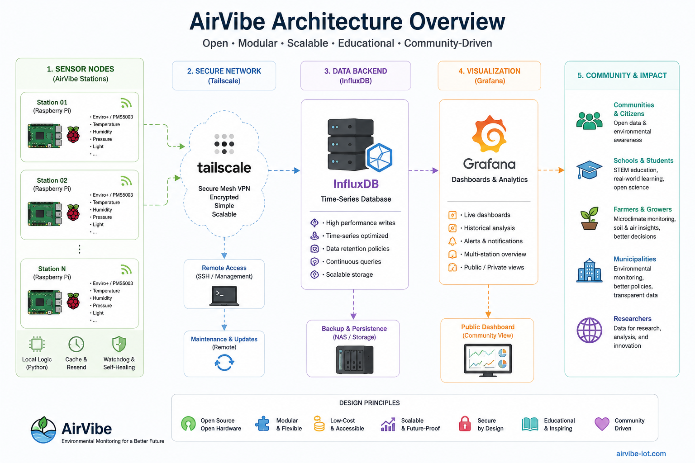

# AirVibe IoT

Open environmental monitoring infrastructure built with Raspberry Pi.

AirVibe is a distributed network of low-cost sensor stations deployed across Slovenia. It combines open-source hardware and software into a practical platform for environmental monitoring, research, education and community participation.

---

## Vision

Environmental monitoring should be accessible, understandable and reproducible.

AirVibe connects sensor stations, open data and communities — bridging researchers, educators, municipalities, citizens and agricultural users through shared environmental infrastructure.

---

## Features

* Raspberry Pi based sensor stations (indoor + outdoor)
* Real-time data collection and centralized InfluxDB storage
* Grafana dashboards and visualizations
* Secure remote management with Tailscale
* Public live map and open data access
* Modular, low-cost and reproducible hardware design

---

## Current Deployments

Current stations include:

* OMS Ljubljana
* Kamna Gorica (farm + quarry environment)
* EIMV laboratories
* Lancovo
* Postojna
* Polhov Gradec

The deployment network changes over time as stations are added, relocated, upgraded or retired.

---

## Public Map

Live station locations and environmental data:

https://airvibe.info

---

## Project in Practice

Real AirVibe deployments and hardware examples:

| Field deployment                                                           | Urban monitoring                                                                   |
| -------------------------------------------------------------------------- | ---------------------------------------------------------------------------------- |
|  |  |

| Hardware kit                                                      | Assembled node                                                        |
| ----------------------------------------------------------------- | --------------------------------------------------------------------- |
|  |  |

---

## Architecture



```text
Sensors → Raspberry Pi → InfluxDB → Grafana → Web Applications
```

Distributed Raspberry Pi nodes send data to a centralized backend for storage, visualization and public access.

Detailed documentation is available in `/docs`.

---

## Documentation

Project documentation is organized in `/docs`.

Current sections include:

* Architecture
* Deployment
* InfluxDB
* Grafana
* Tailscale
* Quick Start

Documentation is continuously updated as the project evolves.

---

## Community Direction

AirVibe currently operates as a distributed environmental monitoring network consisting of research, personal and citizen-operated monitoring stations.

The network includes a mix of:

* research deployments
* independent monitoring sites
* citizen-operated stations
* pilot installations

AirVibe is a living project. Station locations, deployments and monitoring activities may change over time as new sites are added, existing stations are relocated, pilot campaigns are completed or research priorities evolve.

The station network visible today represents the current state of the project and should be viewed as a snapshot rather than a fixed deployment.

As of July 2026, AirVibe combines research-oriented monitoring with early citizen participation and serves as a foundation for future community-based environmental monitoring initiatives.

Potential future directions include:

* STEAM and environmental education
* citizen science projects
* municipal pilot deployments
* agricultural and microclimate monitoring
* open environmental data initiatives

---

## Roadmap

* [x] Distributed Raspberry Pi sensor nodes

* [x] Centralized InfluxDB backend

* [x] Grafana dashboards

* [x] Remote management with Tailscale

* [x] Public live map

* [ ] Simplified node deployment

* [ ] Educational kits for schools

* [ ] Open API

* [ ] Community dashboards

* [ ] Enhanced station status monitoring

* [ ] Agricultural monitoring modules

---

## Repository Structure

```text
airvibe-iot/
├── README.md
├── docs/
├── diagrams/
├── scripts/
├── images/
└── examples/
```

---

## Philosophy

AirVibe is more than an air quality project.

It is an effort to build open, understandable and community-driven environmental infrastructure — using accessible hardware, open-source software and shared data to make environmental monitoring practical, educational and reproducible.

---

## License

MIT License
