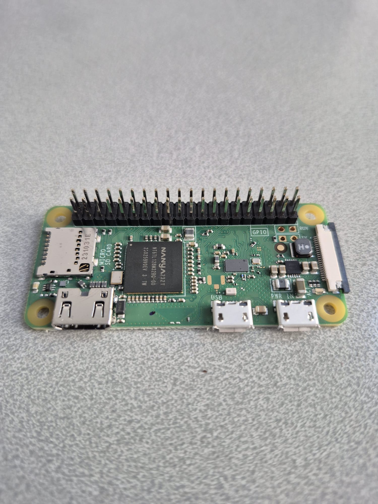
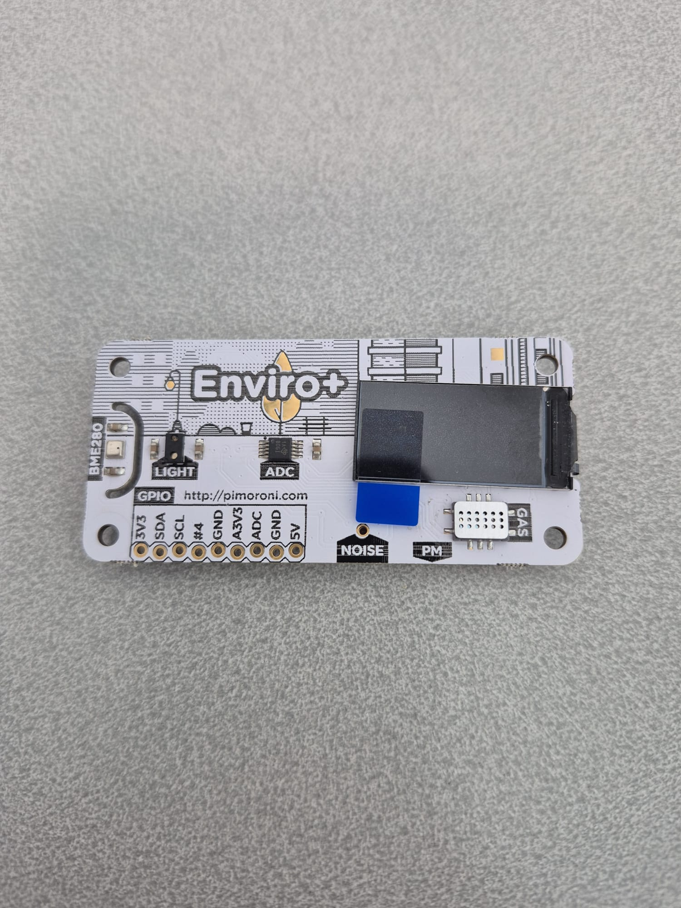
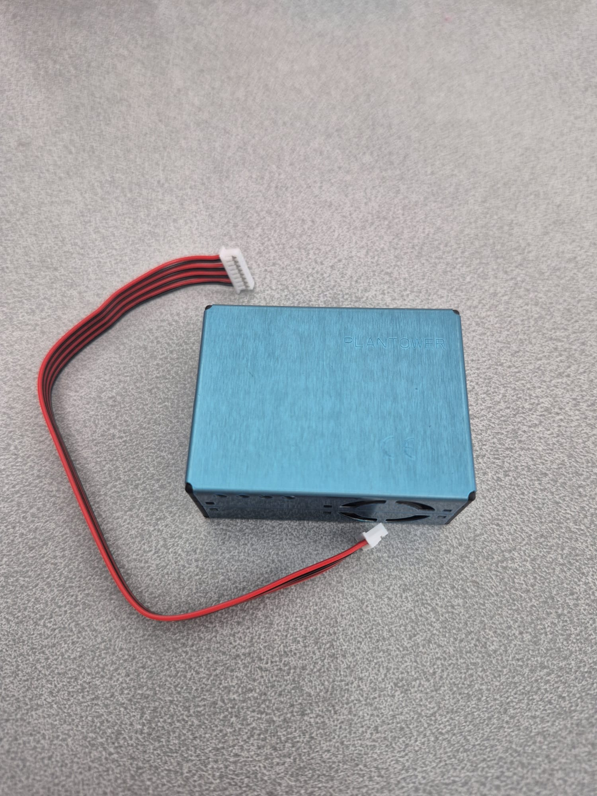
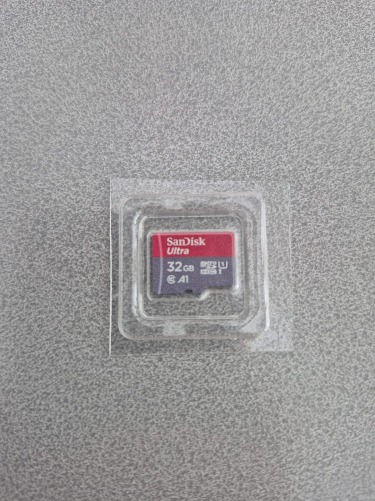
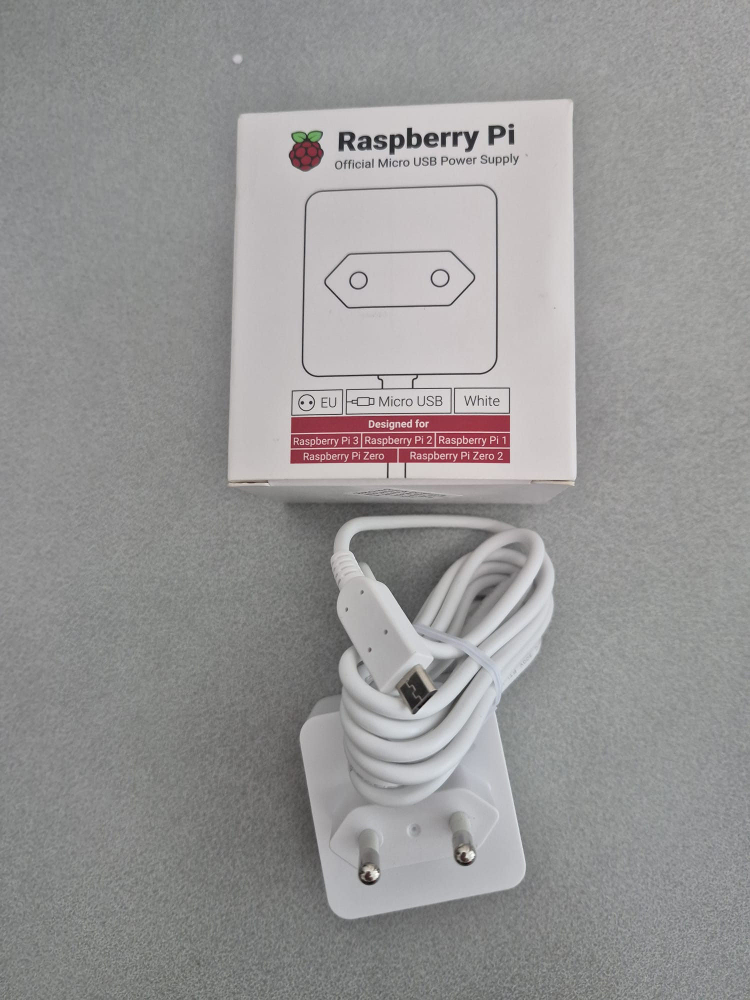
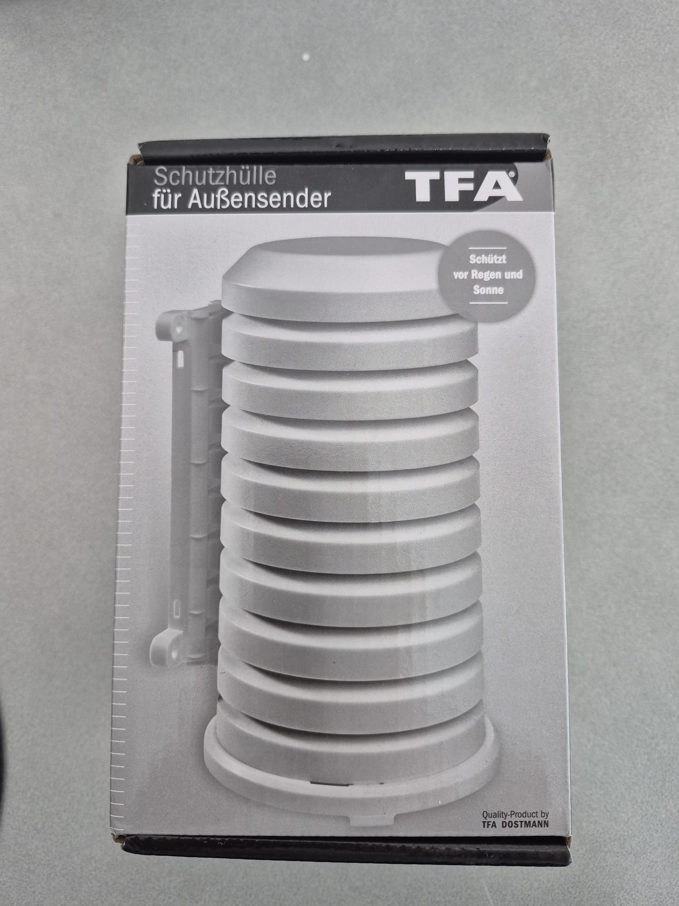

# DOC 1 — AirVibe Starter Station v1 Hardware

**Document ID:** DOC 1  
**Version:** 1.0.3  
**Status:** Released  
**Last Updated:** 2026-07-21

---

# Overview

This document describes the hardware components required to build the AirVibe Starter Station reference implementation.

It introduces each hardware component, explains its purpose within the system, and identifies whether it is required or optional for a standard Starter Station deployment.

The hardware selected for Starter Station v1 is intentionally simple, affordable, well supported, and suitable for education, citizen science, and community air quality monitoring.

---

# Hardware Components

## Raspberry Pi Zero W v1

  

### Purpose

The Raspberry Pi Zero W acts as the central computer of the station.

- Runs Raspberry Pi OS
- Reads sensor data
- Stores measurements
- Connects to Wi-Fi
- Uploads data when required

**Status:** Required

---

## Pimoroni Enviro+

  

### Purpose

The Enviro+ board provides the core environmental measurements used by the Starter Station.

| Measurement | Sensor |
|------------|------------|
| Temperature | BME280 |
| Humidity | BME280 |
| Pressure | BME280 |
| Ambient Light | LTR559 |
| Noise Level | MEMS Microphone |

### Notes

The Enviro+ board also contains gas-related sensors.

These measurements are intentionally excluded from Starter Station v1 and are not covered in the documentation.

**Status:** Required

---

## PMS5003

  

### Purpose

The PMS5003 is a laser-based particulate matter sensor.

It measures:

- PM1.0
- PM2.5
- PM10

The sensor is supplied in its own enclosure with an integrated fan that ensures controlled airflow through the sensing chamber.

**Status:** Required

---

## microSD Card

  

### Recommended Specification

- 32 GB minimum
- Class 10
- A1 or better

**Status:** Required

---

## Raspberry Pi Power Supply

  

### Purpose

Provides stable power to the Raspberry Pi and connected sensors.

**Status:** Required

---

## TFA Radiation Shield

  

### Purpose

The TFA Radiation Shield protects the station from direct sunlight and precipitation while allowing natural airflow around the environmental sensors. It helps reduce temperature measurement bias caused by solar radiation and is recommended for outdoor installations.

**Status:** Recommended

---

# Measurements Provided by Starter Station v1

The reference hardware supports the following measurements:

- Temperature
- Humidity
- Pressure
- Ambient Light
- Noise Level
- PM1.0
- PM2.5
- PM10

---

# Not Included in Starter Station v1

The following technologies and features are outside the scope of the Starter Station v1 documentation:

- Gas sensor measurements
- TSL2591
- MQTT
- Tailscale
- Grafana installation
- Docker
- Advanced cloud deployments

---

# Related Documents

- [DOC 2 — Bill of Materials](bill-of-materials.md)

---

## Next Document

Continue with:

[DOC 3 — Assembly Guide](../02-Assembly/assembly.md)
