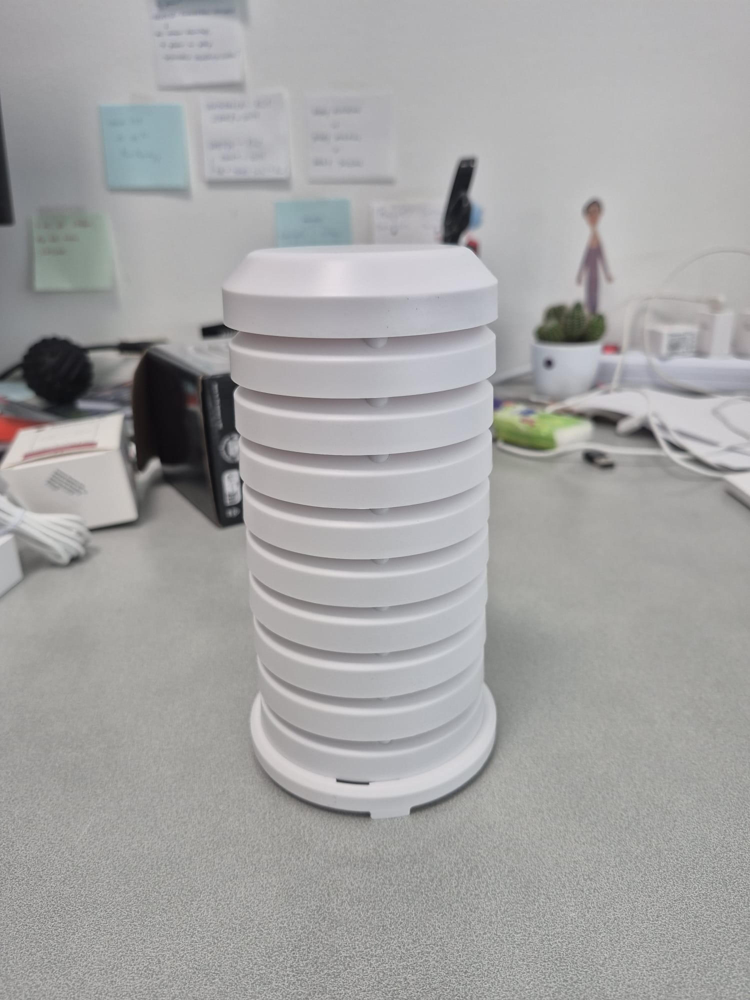

# DOC 1 — AirVibe Starter Station v1 Hardware

**Document ID:** DOC 1  
**Version:** 1.0.0  
**Status:** Released  
**Last Updated:** 2026-07-03

---

# Overview

This document describes the hardware components required to build the AirVibe Starter Station reference implementation.

It introduces each hardware component, explains its purpose within the system, and identifies whether it is required or optional for a standard Starter Station deployment.

The hardware selected for Starter Station v1 is intentionally simple, affordable, well supported, and suitable for education, citizen science, and community air quality monitoring.

---

# Hardware Components

## Raspberry Pi Zero W v1


### Purpose

The Raspberry Pi Zero W acts as the central computer of the station.

- Runs Raspberry Pi OS
- Reads sensor data
- Stores measurements
- Connects to Wi-Fi
- Uploads data when required

**Status:** Required

---

## Pimoroni Enviro+


### Purpose

The Enviro+ board provides the core environmental measurements used by the Starter Station.

| Measurement | Sensor |
|------------|------------|
| Temperature | BME280 |
| Humidity | BME280 |
| Pressure | BME280 |
| Ambient Light | LTR559 |
| Noise Level | MEMS Microphone |

### Notes

The Enviro+ board also contains gas-related sensors.

These measurements are intentionally excluded from Starter Station v1 and are not covered in the documentation.

**Status:** Required

---

## PMS5003


### Purpose

The PMS5003 is a laser-based particulate matter sensor.

It measures:

- PM1.0
- PM2.5
- PM10

**Status:** Required

---

## PMS5003 Enclosure



### Purpose

The enclosure contains the PMS5003 sensor and fan assembly and ensures proper airflow through the sensor.

**Status:** Required

---

## microSD Card


### Recommended Specification

- 32 GB minimum
- Class 10
- A1 or better

**Status:** Required

---

## Raspberry Pi Power Supply


### Purpose

Provides stable power to the Raspberry Pi and connected sensors.

**Status:** Required

---

## TFA Radiation Shield


### Purpose

Protects the station from direct sunlight and rain and helps reduce temperature bias caused by solar radiation.

**Status:** Recommended

---

# Measurements Provided by Starter Station v1

The reference hardware supports the following measurements:

- Temperature
- Humidity
- Pressure
- Ambient Light
- Noise Level
- PM1.0
- PM2.5
- PM10

---

# Not Included in Starter Station v1

The following technologies and features are outside the scope of the Starter Station v1 documentation:

- Gas sensor measurements
- TSL2591
- MQTT
- Tailscale
- Grafana installation
- Docker
- Advanced cloud deployments

---

# Image Files

Create the following directory structure:

```text
01-Hardware/
├── hardware.md
└── images/
    ├── raspberry-pi-zero-w.jpg
    ├── enviro-plus.jpg
    ├── pms5003.jpg
    ├── pms5003-enclosure.jpg
    ├── microsd-card.jpg
    ├── power-supply.jpg
    └── tfa-radiation-shield.jpg
```

---

## Next Document

Continue with:

`02-Assembly/assembly.md`
