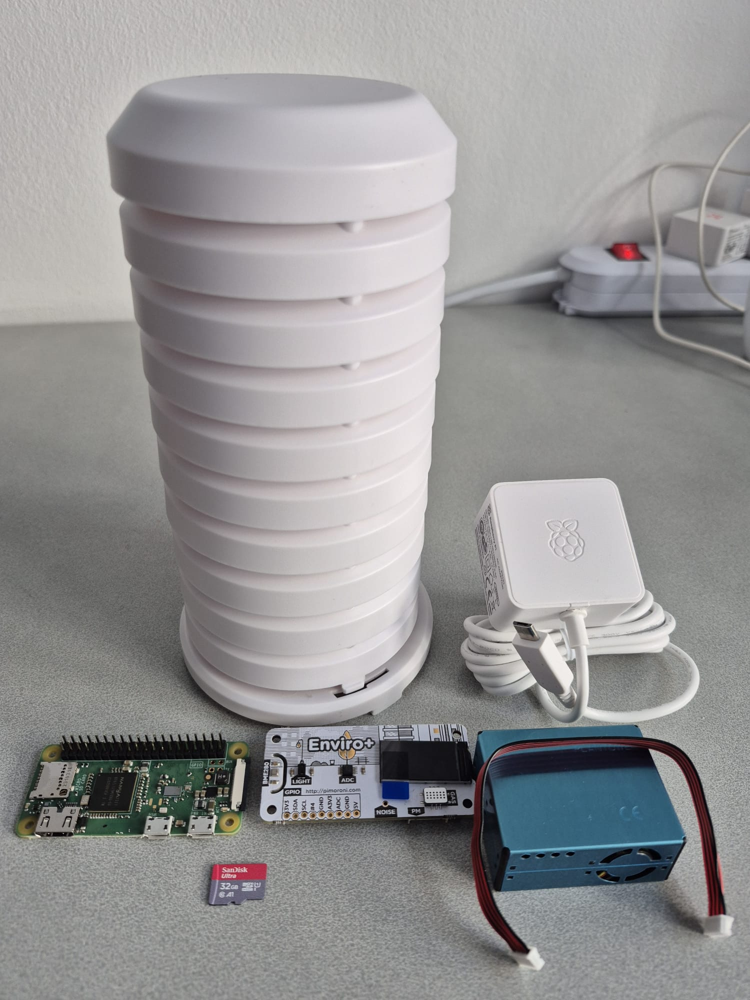
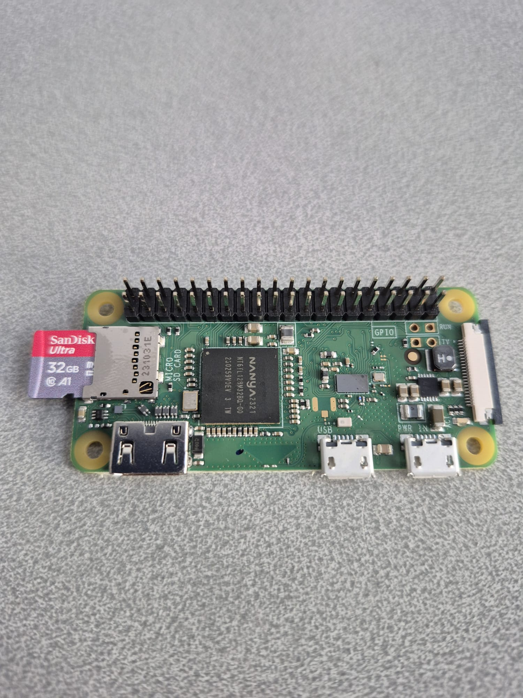
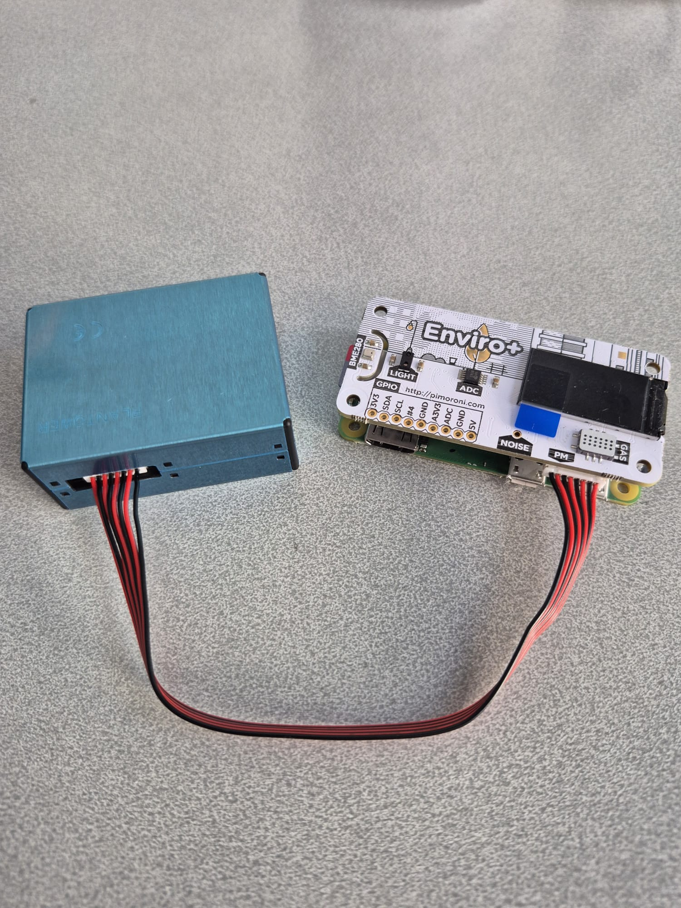
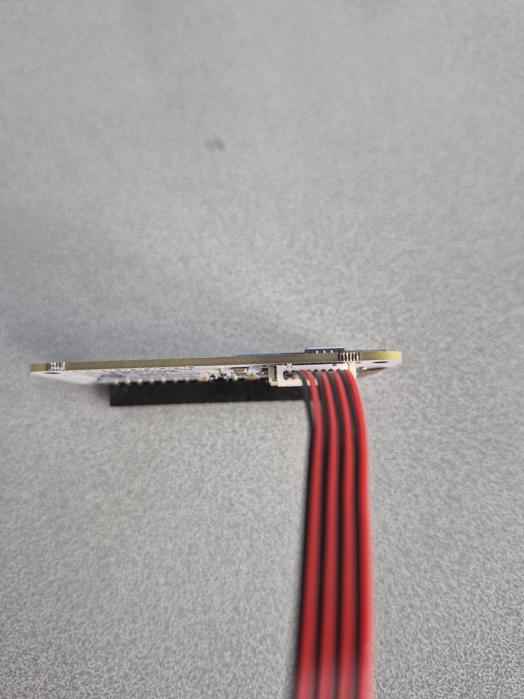
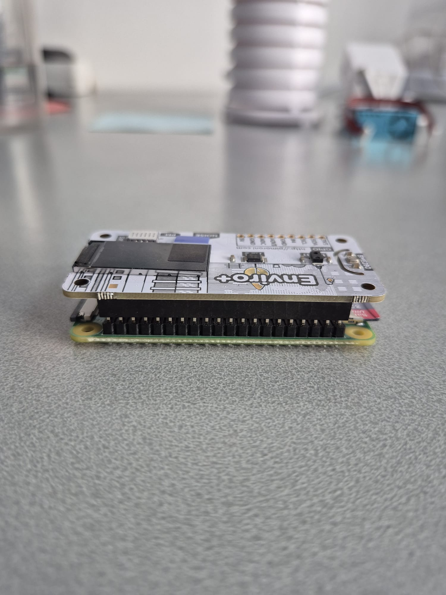
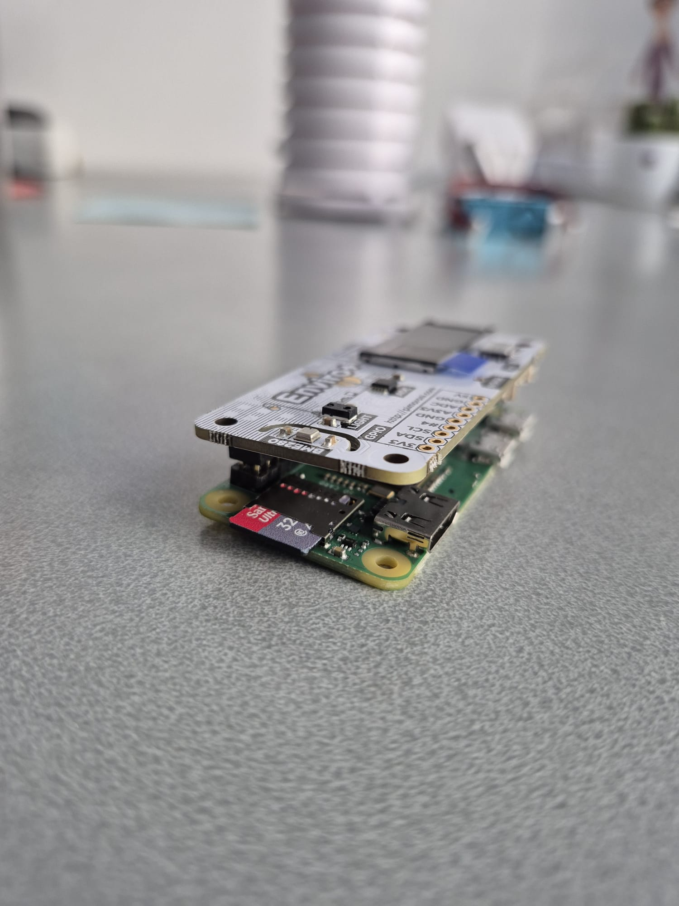
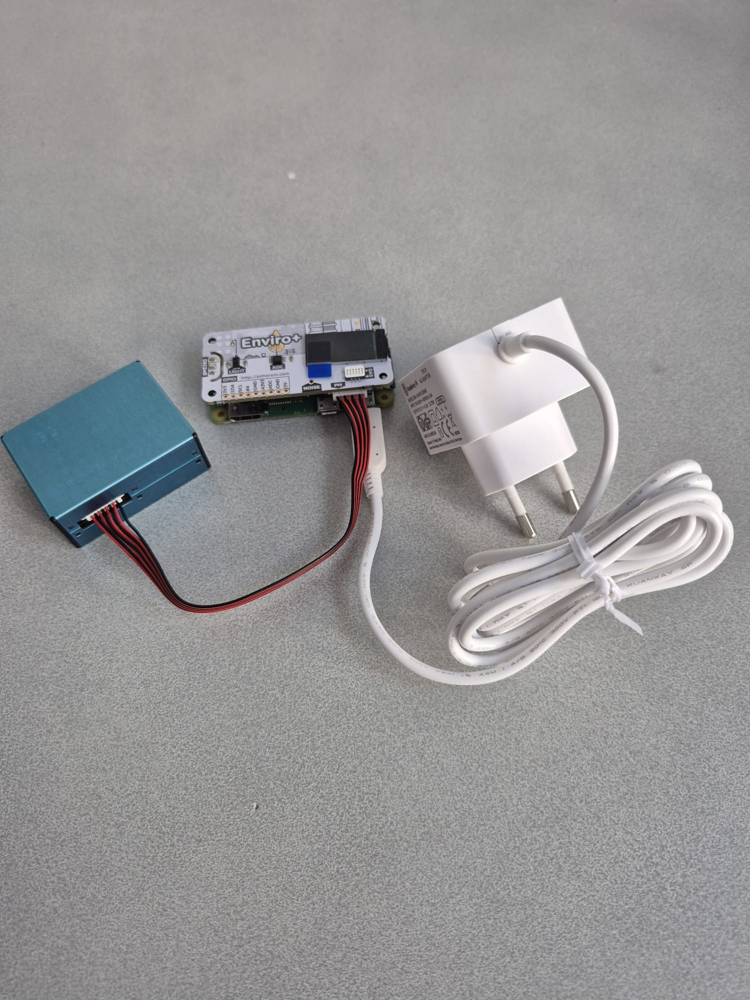

# DOC 3 — AirVibe Starter Station v1 Assembly Guide

**Document ID:** DOC 3  
**Version:** 1.0.2  
**Status:** Released  
**Last Updated:** 2026-07-21

---

# Overview

This guide describes the physical assembly of the AirVibe Starter Station reference implementation.

It explains how to assemble the hardware components in the correct order and highlights important handling recommendations to help prevent accidental damage during assembly.

Before starting, verify that all required components listed in **DOC 2 — Bill of Materials (BOM)** are available.

---

## Step 1 — Components Overview

  

The AirVibe Starter Station consists of the following components:

- Raspberry Pi Zero W
- Pimoroni Enviro+
- PMS5003 particulate matter sensor
- microSD card
- Raspberry Pi power supply
- Radiation shield (recommended)

Verify that all components are present before proceeding.

---

## Step 2 — Insert the microSD Card

  

Insert the microSD card into the Raspberry Pi Zero W.

Ensure that the card is fully seated in the slot.

### Note

The microSD card contains the operating system and configuration files required for the station to operate.

---

## Step 3 — Connect the PMS5003 Sensor

  

Before mounting the Enviro+ board onto the Raspberry Pi, connect the PMS5003 cable to the Enviro+ board.

This makes the connection easier and reduces stress on the GPIO header.

### Connector Detail

  

The PMS5003 connector is keyed and fits in only one orientation.

Carefully align the connector before inserting it.

Apply gentle and even pressure until the connector is fully seated.

A small screwdriver can be helpful for gently pressing the connector into place if required.

### Important

Do not force the connector.

If resistance is encountered, verify that the connector orientation is correct.

---

## Step 4 — Mount the Enviro+ Board

  

Align the Enviro+ board with the Raspberry Pi GPIO header.

Carefully press the board straight down until it is fully seated.

Ensure that all header pins enter the connector correctly.

### Side View

  

The Enviro+ board should sit evenly on the GPIO header without visible gaps.

### Important

The Enviro+ board may fit tightly on the GPIO header.

If the board ever needs to be removed, it is recommended to remove the microSD card first.

This helps prevent accidental damage to the card while handling the board.

---

## Step 5 — Verify Physical Assembly

  

Verify that:

- the microSD card is installed
- the PMS5003 cable is connected securely
- the Enviro+ board is mounted correctly
- the PMS5003 sensor is connected
- the power cable is connected to the Raspberry Pi

### Raspberry Pi Zero W Connectors

The Raspberry Pi Zero W has two micro-USB connectors:

- **USB** — Data connection
- **PWR** — Power connection

Always connect the power supply to the **PWR** connector.

---

# Assembly Complete

The physical assembly of the AirVibe Starter Station is now complete.

The hardware is ready for operating system installation.

---

## Completion Check

Before continuing, verify that:

- [ ] the microSD card is fully inserted
- [ ] the PMS5003 cable is securely connected
- [ ] the Enviro+ board is fully seated on the GPIO header
- [ ] the PMS5003 sensor is connected
- [ ] the power supply is connected to the **PWR** connector

---

## Related Documents

- [DOC 1 — Hardware](../01-Hardware/hardware.md)
- [DOC 2 — Bill of Materials (BOM)](../01-Hardware/bill-of-materials.md)

---

## Next Document

Continue with:

- [03-Operating-System/flash-sd-card.md](../03-Operating-System/flash-sd-card.md)