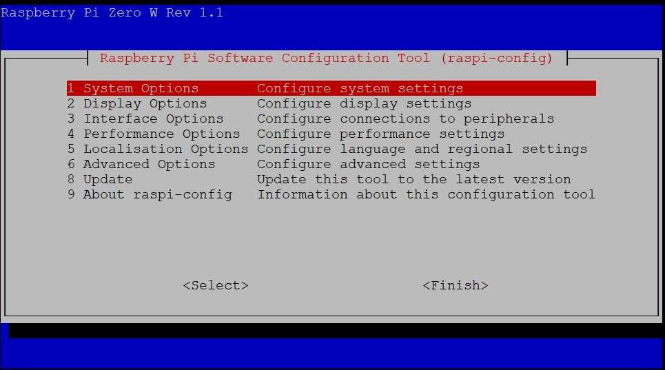
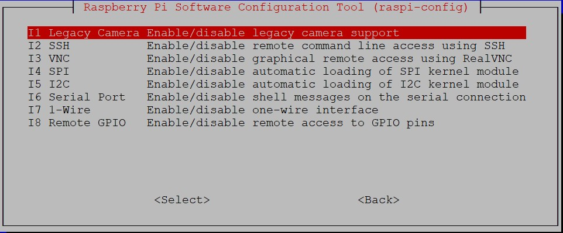
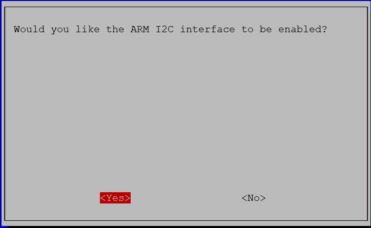
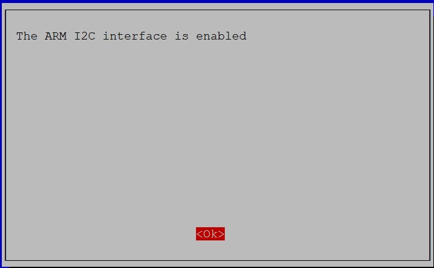
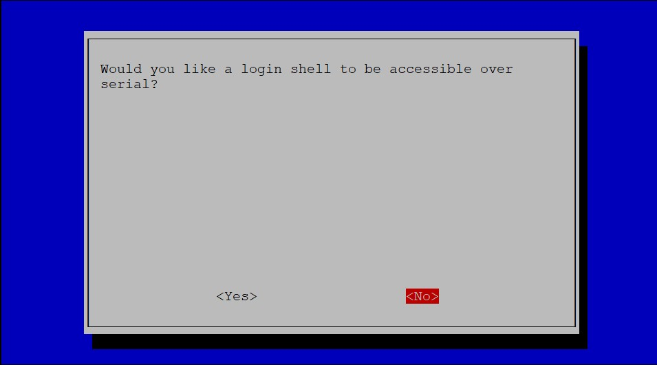
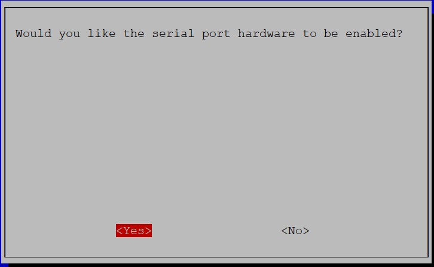
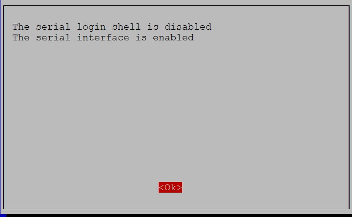
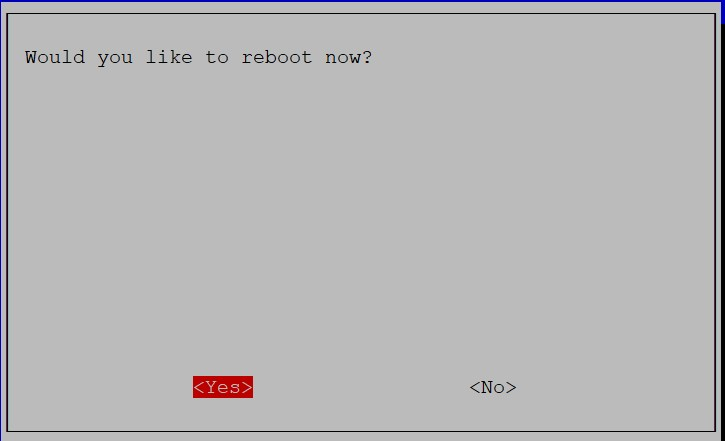

# DOC 6 — Enable Interfaces

**Document ID:** DOC 6  
**Category:** 03-Software  
**Status:** Released  
**Version:** 1.0.0  
**Last Updated:** 2026-07-07  
**Scope:** AirVibe Starter Station  
**Reference Operating System:** Raspberry Pi OS Lite Legacy (Bullseye) 32-bit  
**Estimated Time:** 5–10 minutes  
**Difficulty:** Beginner

---

# Overview

This document describes how to enable the hardware interfaces required by the AirVibe Starter Station using the Raspberry Pi Software Configuration Tool (`raspi-config`).

The procedure enables the I2C interface and the hardware serial interface (UART), both of which are required by the AirVibe Starter Station reference implementation.

This document is based on the verified AirVibe reference implementation and has been validated on the AirVibe reference station.

---

# Prerequisites

Before starting, ensure that:

- DOC 5 — First Boot has been completed successfully.
- Raspberry Pi OS Lite Legacy (Bullseye) 32-bit is running.
- You are connected to the Raspberry Pi using SSH.
- You are logged in with a user account that has `sudo` privileges.

---

# Step 1 — Open Raspberry Pi Configuration



Open the Raspberry Pi Software Configuration Tool.

```bash
sudo raspi-config
```

The Raspberry Pi Software Configuration Tool opens.

Select **Interface Options**.

---

# Step 2 — Open Interface Options



From the main menu, select **Interface Options**.

The AirVibe Starter Station requires the following hardware interfaces:

- I2C
- Serial Port

---

# Step 3 — Enable I2C



Select **I5 I2C**.

When prompted to enable the ARM I2C interface, select **<Yes>**.



When the confirmation message appears:

> The ARM I2C interface is enabled.

Select **<Ok>**.

The Raspberry Pi returns to the **Interface Options** menu.

---

# Step 4 — Disable the Serial Login Shell



Select **I6 Serial Port**.

When prompted to allow a login shell over the serial interface, select **<No>**.

### Important

The AirVibe Starter Station uses the Raspberry Pi hardware serial interface to communicate with the PMS5003 particulate matter sensor.

The serial login shell must be disabled before enabling the hardware serial interface.

---

# Step 5 — Enable the Hardware Serial Interface



When prompted to enable the hardware serial interface, select **<Yes>**.



When the confirmation message appears:

- The serial login shell is disabled.
- The serial interface is enabled.

Select **<Ok>**.

The Raspberry Pi returns to the **Interface Options** menu.

---

# Step 6 — Reboot the Raspberry Pi



Press **Finish** to exit the Raspberry Pi Software Configuration Tool.

When prompted:

> Would you like to reboot now?

Select **<Yes>**.

Allow the Raspberry Pi to restart completely before reconnecting using SSH.

Reconnect using:

```bash
ssh <username>@<hostname>.local
```

or

```bash
ssh <username>@<ip-address>
```

---

# Final Verification

After reconnecting, verify that the required hardware interfaces are available.

Verify the I2C interface.

```bash
ls /dev/i2c*
```

Example output:

```text
/dev/i2c-1
/dev/i2c-2
```

Verify the primary hardware serial interface.

```bash
ls -l /dev/serial0
```

Example output:

```text
lrwxrwxrwx ... /dev/serial0 -> ttyS0
```

The `serial0` device always points to the primary hardware serial interface used by the AirVibe Starter Station.

If both commands complete successfully, the required hardware interfaces have been configured correctly.

---

# Final Verification Checklist

- [ ] Raspberry Pi Software Configuration Tool opened successfully.
- [ ] I2C interface enabled.
- [ ] Serial login shell disabled.
- [ ] Hardware serial interface enabled.
- [ ] Raspberry Pi rebooted successfully.
- [ ] SSH connection re-established.
- [ ] I2C interface verified.
- [ ] Hardware serial interface verified.
- [ ] System ready for Enviro+ installation.

---

# Related Documents

- DOC 5 — First Boot (`first-boot.md`)
- REFERENCE DOC A — Reference Operating System

---

## Next Document

Continue with:

`DOC 7 — install-enviro-plus.md`
