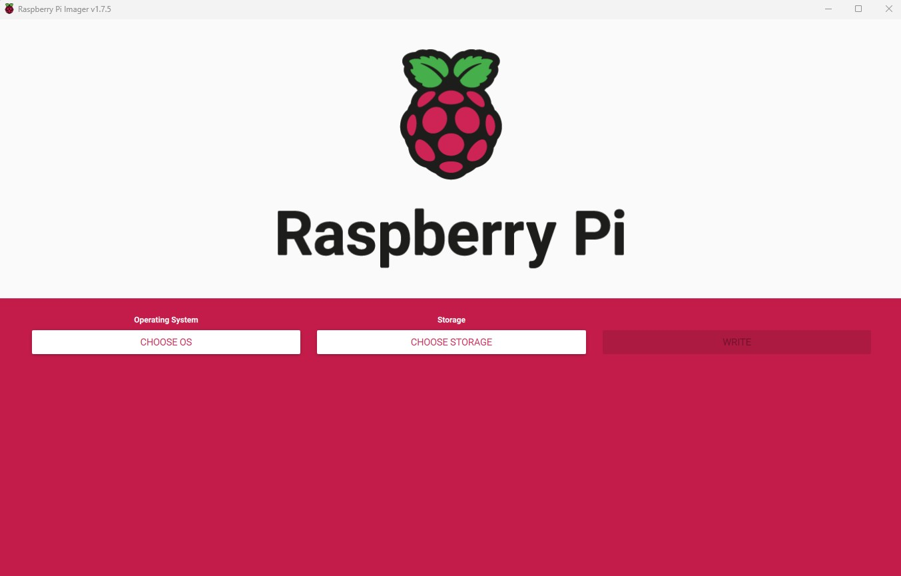
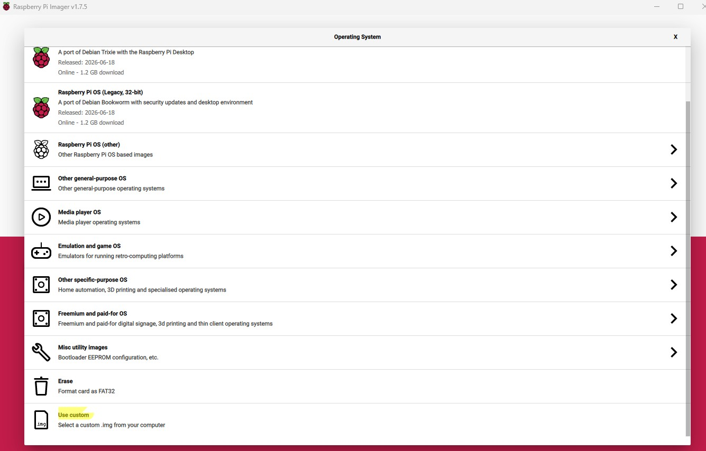
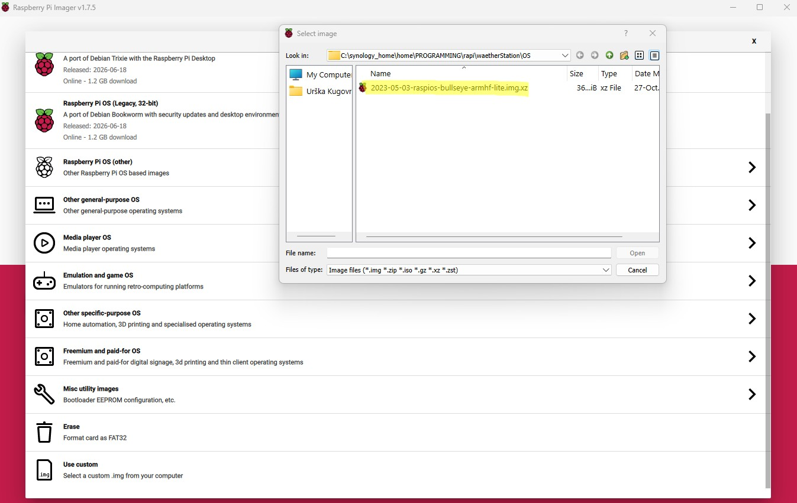
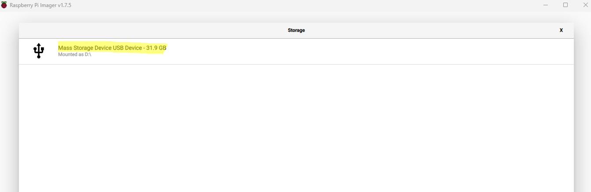
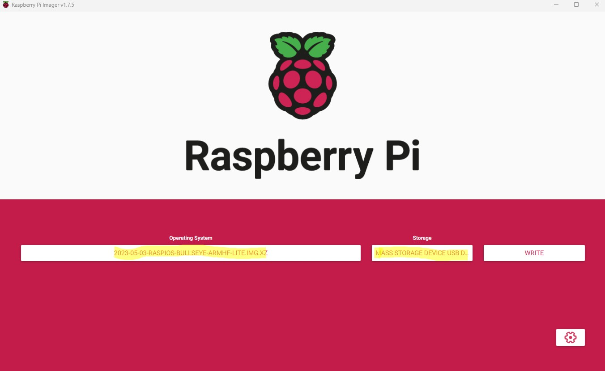
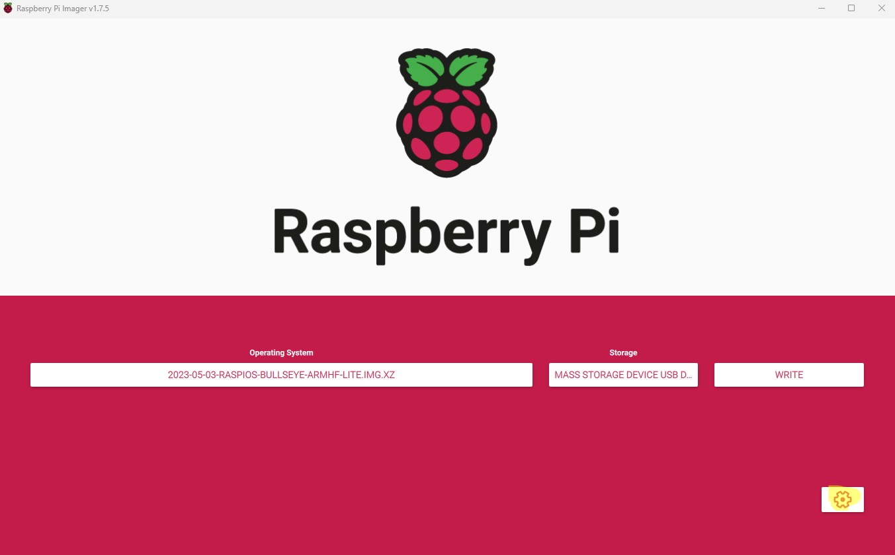
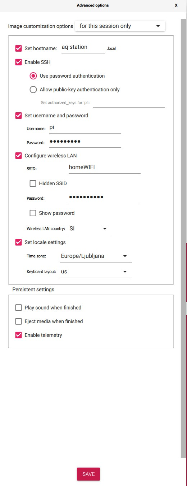
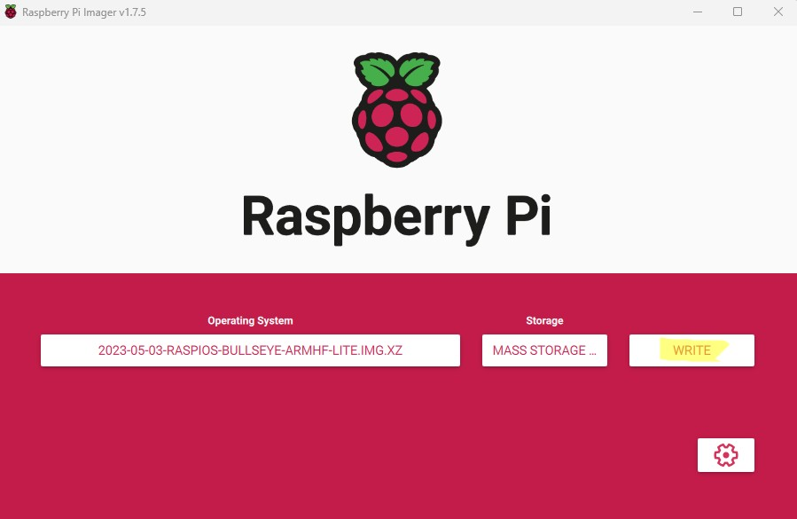
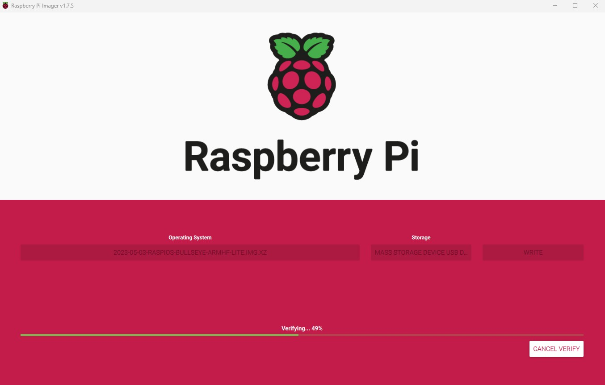
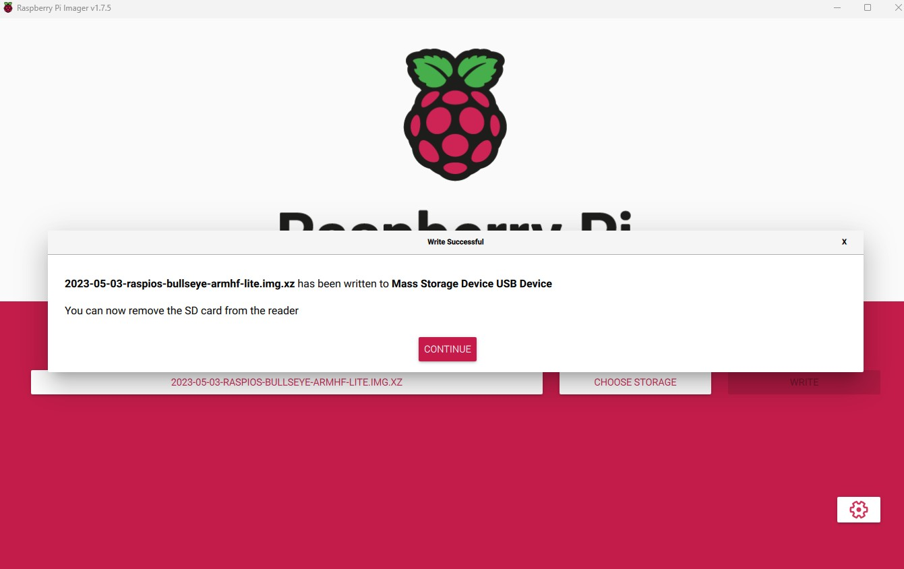

# DOC 4 — Operating System Installation

**Document ID:** DOC 4  
**Category:** 03-Software  
**Status:** Released  
**Version:** 1.1.0  
**Last Updated:** 2026-07-21  
**Scope:** AirVibe Starter Station  
**Reference Operating System:** Raspberry Pi OS Lite Legacy (Bullseye) 32-bit  
**Reference Image:** `2023-05-03-raspios-bullseye-armhf-lite.img.xz`  
**Raspberry Pi Imager Version:** 1.7.5  
**Estimated Time:** 15–30 minutes  
**Difficulty:** Beginner

---

# Overview

This document describes how to prepare a microSD card for the AirVibe Starter Station reference implementation using Raspberry Pi Imager.

The procedure writes the verified AirVibe reference operating system image to the microSD card and configures the settings required for a headless first boot over Wi-Fi.

This document is based on the AirVibe reference operating system described in **REFERENCE DOC A — Reference Operating System**.

---

# Reference Configuration

The verified AirVibe Starter Station uses:

- Raspberry Pi OS Lite Legacy (Bullseye) 32-bit
- reference image `2023-05-03-raspios-bullseye-armhf-lite.img.xz`
- hostname `aq-off`
- Wi-Fi network access
- SSH remote access
- no monitor, keyboard, mouse, or Ethernet connection

For information about the operating system selection, supported hardware, image checksum, and engineering rationale, see:

[REFERENCE DOC A — Reference Operating System](../00-Reference/reference-os.md)

---

# Prerequisites

Before starting, ensure that:

- Raspberry Pi Imager is installed on the computer.
- The verified reference image has been downloaded.
- A compatible microSD card is available.
- A microSD card reader is connected to the computer.
- The Wi-Fi network name and password are available.
- Any required files on the microSD card have been backed up.

### Important

Writing an operating system image permanently erases all existing data on the selected storage device.

Verify the selected storage device carefully before beginning the write process.

---

# Step 1 — Open Raspberry Pi Imager

<div align="center">
  
</div>

Open Raspberry Pi Imager.

This procedure was documented using:

```text
Raspberry Pi Imager v1.7.5
```

The interface may differ slightly in other Raspberry Pi Imager versions.

---

# Step 2 — Select the Operating System Image

<div align="center">
  
</div>

Select:

**Choose OS → Use custom**

The **Use custom** option allows the verified AirVibe reference operating system image to be selected manually.

---

# Step 3 — Select the Reference Image

<div align="center">
  
</div>

Browse to the downloaded operating system image and select:

```text
2023-05-03-raspios-bullseye-armhf-lite.img.xz
```

### Important

Confirm that the selected filename exactly matches the verified AirVibe reference image.

For information about obtaining and verifying the image, see:

[REFERENCE DOC A — Reference Operating System](../00-Reference/reference-os.md)

---

# Step 4 — Select the Storage Device

<div align="center">
  
</div>

Insert the microSD card into the card reader.

Select **Choose Storage** and choose the correct microSD card.

### Important

Selecting the wrong device may erase data from another drive connected to the computer.

---

# Step 5 — Verify the Image and Storage Selection

<div align="center">
  
</div>

Verify that:

- the reference operating system image is selected
- the intended microSD card is selected

Proceed only after both selections have been confirmed.

---

# Step 6 — Open Advanced Options

<div align="center">
  
</div>

Select the gear icon to open the advanced configuration menu.

The advanced options configure the system before the first boot.

---

# Step 7 — Configure the Reference System

<div align="center">
  
</div>

Configure the following settings.

## Hostname

Use the verified reference hostname:

```text
aq-off
```

## User Account

Configure the username and password recorded for the station deployment.

Keep these credentials available. They are required when connecting through PuTTY during the first boot procedure.

## SSH

Enable SSH.

SSH is required because the AirVibe Starter Station uses a headless installation workflow.

## Wireless LAN

Configure:

- Wi-Fi network name (SSID)
- Wi-Fi password
- wireless LAN country

### Important

The AirVibe Starter Station reference implementation connects through Wi-Fi only.

Enter the Wi-Fi details carefully. Incorrect settings will prevent the Raspberry Pi from appearing on the network after the first boot.

The computer used for the first boot procedure must later be connected to the same local network as the Raspberry Pi.

## Locale

Configure the appropriate:

- timezone
- keyboard layout
- locale

These settings should match the installation location.

---

# Step 8 — Save the Advanced Options

Review the configured settings and save the advanced options.

Before continuing, confirm that:

- hostname is `aq-off`
- the correct Wi-Fi network is configured
- the wireless LAN country is correct
- SSH is enabled
- the username and password are recorded
- locale, timezone, and keyboard layout are correct

Return to the main Raspberry Pi Imager window and verify that the operating system image and storage device remain correctly selected.

---

# Step 9 — Write the Operating System Image

<div align="center">
  
</div>

Select **Write** to begin writing the operating system image to the microSD card.

When the warning appears, confirm that the selected storage device may be erased.

### Important

All existing data on the selected microSD card will be permanently deleted.

Do not continue unless the correct storage device has been selected.

---

# Step 10 — Wait for Writing and Verification

<div align="center">
  
</div>

Raspberry Pi Imager performs two operations:

1. Writes the operating system image.
2. Verifies the written data.

Do not remove the microSD card, disconnect the card reader, shut down the computer, or interrupt Raspberry Pi Imager.

Allow both operations to complete successfully.

---

# Step 11 — Confirm Successful Completion

<div align="center">
  
</div>

When Raspberry Pi Imager reports that writing has completed successfully, select **Continue**.

The microSD card now contains the reference operating system and the configuration required for Wi-Fi and SSH access.

---

# Step 12 — Safely Remove the microSD Card

Safely eject the microSD card from the computer.

Remove the card from the card reader only after the operating system confirms that it can be removed safely.

---

# Step 13 — Insert the Prepared microSD Card

<div align="center">
  
</div>

Insert the prepared microSD card into the Raspberry Pi.

Ensure that the card is fully seated before connecting power.

---

# Completion Check

Before continuing, confirm that:

- [ ] The verified AirVibe reference image was written successfully.
- [ ] Raspberry Pi Imager completed data verification without errors.
- [ ] Hostname `aq-off` was configured.
- [ ] The correct Wi-Fi network and wireless LAN country were configured.
- [ ] SSH was enabled.
- [ ] The station username and password were recorded.
- [ ] The microSD card was safely ejected and inserted into the Raspberry Pi.

The Raspberry Pi is now ready for the first boot procedure.

### Important

Do not expect the Raspberry Pi to appear on the network immediately after power is connected. The first boot may take several minutes. Follow the waiting, discovery, and troubleshooting procedure in DOC 5.

---

# Related Documents

- [REFERENCE DOC A — Reference Operating System](../00-Reference/reference-os.md)
- [DOC 5 — First Boot](first-boot.md)

---

## Next Document

Continue with:

[DOC 5 — First Boot](first-boot.md)
