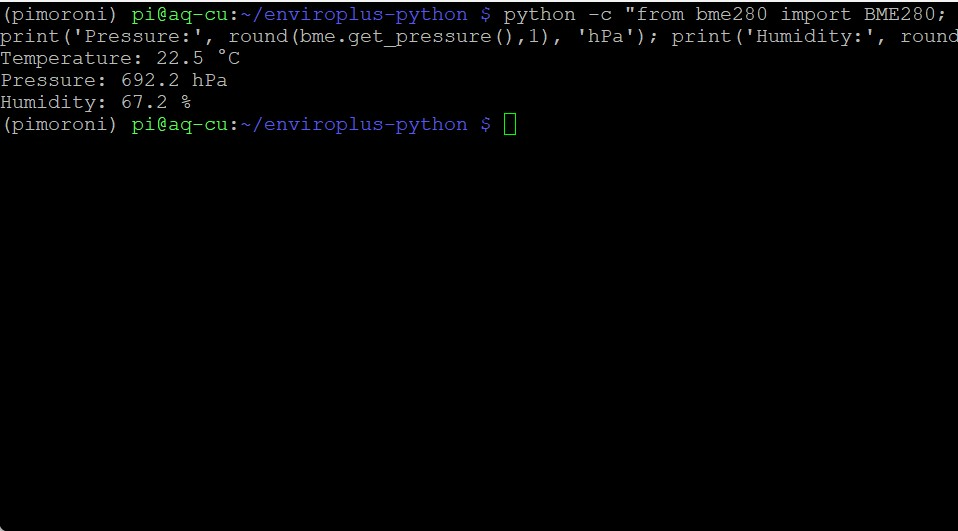
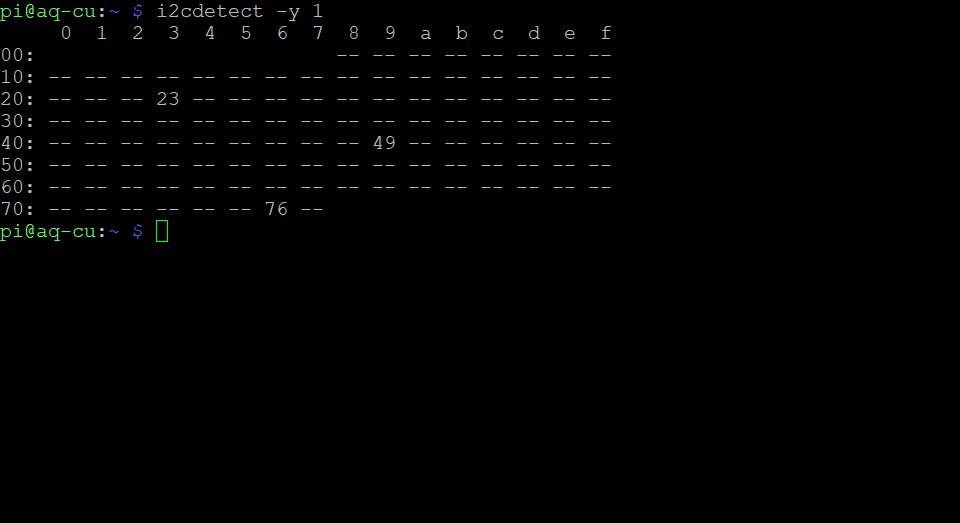
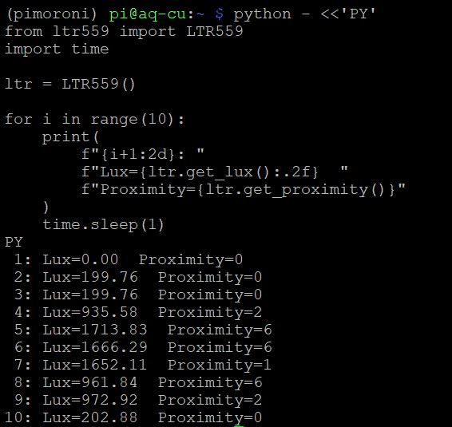
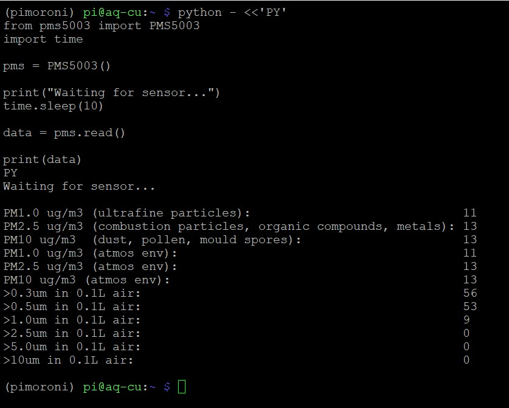

# DOC 8 — Verify Sensors

**Document ID:** DOC 8  
**Category:** 03-Software  
**Version:** 0.3.0  
**Status:** Draft  
**Last Updated:** 2026-07-31  
**Scope:** AirVibe Starter Station  
**Reference Operating System:** Raspberry Pi OS Lite Legacy (Bullseye) 32-bit  

---

# Overview

This document verifies the AirVibe Starter Station sensors after completing DOC 7 — Install Enviro+.

The verification is performed one sensor at a time so that any failure can be isolated to a specific component or communication interface.

The onboard LCD is not required by the AirVibe Starter Station reference implementation and is outside the scope of this document.

---

# Prerequisites

Before starting, ensure that:

- DOC 7 — Install Enviro+ has been completed successfully.
- The Raspberry Pi is connected to the complete AirVibe Starter Station hardware assembly.
- An SSH connection to the Raspberry Pi has been established.
- The current user account has `sudo` privileges.
- The Pimoroni virtual environment exists at `~/.virtualenvs/pimoroni`.

---

# Step 1 — Activate and Verify the Python Environment

## Execution Environment

- Shell: Bash
- Virtual Environment: **No**, before running the activation command
- Current Directory: `~/enviroplus-python`

Activate the environment:

```bash
source ~/.virtualenvs/pimoroni/bin/activate
```

The shell prompt should now begin with:

```text
(pimoroni)
```

Verify the active Python interpreter and Enviro+ package:

```bash
which python
python --version
python -c "import enviroplus; print('enviroplus OK')"
```

Verified result:

```text
/home/pi/.virtualenvs/pimoroni/bin/python
Python 3.9.2
enviroplus OK
```

---

# Step 2 — Verify the BME280 Environmental Sensor

## Execution Environment

- Shell: Bash
- Virtual Environment: **Yes — `pimoroni`**
- Current Directory: `~/enviroplus-python`

Run:

```bash
python -c "from bme280 import BME280; bme = BME280(); print('Temperature:', round(bme.get_temperature(),1), '°C'); print('Pressure:', round(bme.get_pressure(),1), 'hPa'); print('Humidity:', round(bme.get_humidity(),1), '%')"
```

Verified example result:

```text
Temperature: 22.5 °C
Pressure: 692.2 hPa
Humidity: 67.2 %
```

<div align="center">
  
</div>

<p align="center"><strong>Figure 1.</strong> Verified BME280 temperature, pressure, and humidity readings on the AirVibe Starter Station.</p>

The verification is successful when the command returns numeric temperature, pressure, and humidity values without an exception.

---

# Step 3 — Verify the I2C Devices

## Execution Environment

- Shell: Bash
- Virtual Environment: **Yes or No**
- Internet Connection: Required only when installing `i2c-tools`

The `i2cdetect` command is provided by the `i2c-tools` package. If the command is not available, install it:

```bash
sudo apt install i2c-tools
```

When prompted to continue, enter:

```text
Y
```

Scan I2C bus 1:

```bash
i2cdetect -y 1
```

The verified AirVibe Starter Station detects:

| I2C address | Device |
|---|---|
| `0x23` | LTR559 light and proximity sensor |
| `0x49` | ADS1015 analogue-to-digital converter |
| `0x76` | BME280 environmental sensor |

<div align="center">
  
</div>

<p align="center"><strong>Figure 2.</strong> The LTR559, ADS1015, and BME280 devices detected on I2C bus 1.</p>

The verification is successful when addresses `23`, `49`, and `76` are present in the scan.

---

# Step 4 — Verify the LTR559 Light and Proximity Sensor

## Execution Environment

- Shell: Bash
- Virtual Environment: **Yes — `pimoroni`**
- Current Directory: `~/enviroplus-python`

If the virtual environment is not active, activate it:

```bash
source ~/.virtualenvs/pimoroni/bin/activate
```

A single reading immediately after sensor initialization may return zero values. Use repeated measurements and change the light level or move an object near the sensor during the test.

Run:

```bash
python - <<'PY'
from ltr559 import LTR559
import time

ltr = LTR559()

for i in range(10):
    print(
        f"{i+1:2d}: "
        f"Lux={ltr.get_lux():.2f}  "
        f"Proximity={ltr.get_proximity()}"
    )
    time.sleep(1)
PY
```

During the test:

- Leave the sensor undisturbed for the first few readings.
- Change the amount of light reaching the sensor.
- Move a hand or object close to the proximity sensor.

Verified example result:

```text
 1: Lux=0.00     Proximity=0
 2: Lux=199.76   Proximity=0
 3: Lux=199.76   Proximity=0
 4: Lux=935.58   Proximity=2
 5: Lux=1713.83  Proximity=6
 6: Lux=1666.29  Proximity=6
 7: Lux=1652.11  Proximity=1
 8: Lux=961.84   Proximity=6
 9: Lux=972.92   Proximity=2
10: Lux=202.88   Proximity=0
```

<div align="center">
  
</div>

<p align="center"><strong>Figure 3.</strong> Functional verification of the LTR559 sensor showing changing light measurements and proximity responses.</p>

The verification is successful when the Lux values respond to changing illumination and the proximity value responds when an object is moved near the sensor.

---

# Step 5 — Verify the PMS5003 Particulate Matter Sensor

## Execution Environment

- Shell: Bash
- Virtual Environment: **Yes — `pimoroni`**
- Current Directory: `~/enviroplus-python`

Run:

```bash
python - <<'PY'
from pms5003 import PMS5003
import time

pms = PMS5003()

print("Waiting for sensor...")
time.sleep(10)

data = pms.read()

print(data)
PY
```

The delay allows the sensor fan and measurement system to stabilize before the first reading is evaluated.

Verified example result:

```text
PM1.0 ug/m3 (ultrafine particles): 11
PM2.5 ug/m3 (combustion particles, organic compounds, metals): 13
PM10 ug/m3 (dust, pollen, mould spores): 13
PM1.0 ug/m3 (atmos env): 11
PM2.5 ug/m3 (atmos env): 13
PM10 ug/m3 (atmos env): 13
>0.3um in 0.1L air: 56
>0.5um in 0.1L air: 53
>1.0um in 0.1L air: 9
>2.5um in 0.1L air: 0
>5.0um in 0.1L air: 0
>10um in 0.1L air: 0
```

<div align="center">
  
</div>

<p align="center"><strong>Figure 4.</strong> Successful functional verification of the PMS5003 particulate matter sensor showing PM1.0, PM2.5, PM10, and particle-count measurements.</p>

The verification is successful when the sensor returns numeric PM1.0, PM2.5, and PM10 values together with particle counts without a serial communication exception.

---

# Completion Check

Confirm that:

- [ ] The `pimoroni` virtual environment was activated successfully.
- [ ] The Enviro+ Python package imported successfully.
- [ ] The BME280 returned temperature, pressure, and humidity values.
- [ ] The I2C scan detected addresses `23`, `49`, and `76`.
- [ ] The LTR559 returned changing light values and proximity responses.
- [ ] The PMS5003 returned PM1.0, PM2.5, and PM10 measurements.

The AirVibe Starter Station sensors are now functionally verified.

---

# Related Documents

- [DOC 6 — Enable Interfaces](enable-interfaces.md)
- [DOC 7 — Install Enviro+](install-enviro-plus.md)
- [REFERENCE DOC A — Reference Operating System](../00-Reference/reference-os.md)
